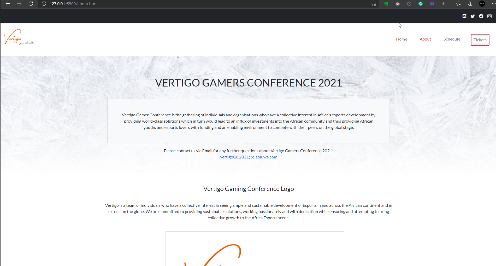
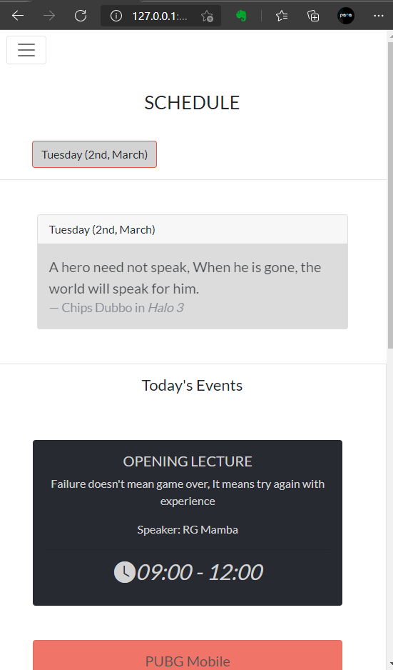

# Capstone Project - Vertigo Gamers Conference

> Capstone projects are solo projects at the end of the each of the Microverse Main Technical Curriculum section. 

The project is to build a Conference website and I opted to build one that applies to esports gamers. It has three pages.
- The Home page
- The Schedule page
- The About page

Each of these pages have versions for 2 different screen sizes: 

- mobile: up to 768px
- desktop: from 768px

## Built With

- HTML
- BootStrap
- CSS

## Live Demo

[Live Demo Link](https://crappypapa.github.io/Vertigo/index.html)

## Getting Started

To get a local copy up and running follow these simple example steps.

Clone directory using GitHub. 

You can run by opening the file in your browser as well!

Live preview available at Link

### Run tests

- Run npx hint ." to check errors on HTML
- Run npx stylelint "**/*.{css,scss}" to check errors on the CSS

## Authors

👤 **Author1**

- GitHub: [@crappypapa](https://github.com/crappypapa)
- Twitter: [@_laoluwa](https://twitter.com/_laoluwa)
- LinkedIn: [Olaoluwa](https://linkedin.com/in/olaoluwa-soladoye)

## 🤝 Contributing

Contributions, issues, and feature requests are welcome!

Feel free to check the [issues page](issues/).

## Show your support

Give a ⭐️ if you like this project!

## Acknowledgments

- [Cindy Shin ](https://www.behance.net/adagio07)

## 📝 License

This project is [Microverse](https://microverse.org) licensed.
